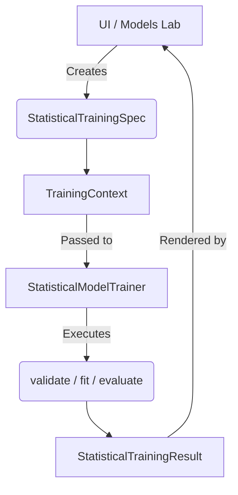

# Statistical Training Contract

## Architecture
The BotorView application separates UI logic from scientific statistical model fitting.
The common statistical training contract abstracts away underlying Python libraries (like statsmodels, prophet, tbats) providing a unified data structure for experimental configuration, execution, evaluation, and structured results.

## Common Training Workflow
1. **Spec Creation**: A `StatisticalTrainingSpec` is instantiated containing the model type, target, exogenous variables, split ratios, config, and forecast horizon.
2. **Context Assembly**: The `TrainingContext.create(spec, dataset)` is called. This copies the dataset (ensuring immutability) and creates an `ExperimentSplit` (a chronological train/validation/test split).
3. **Training**: A specific `StatisticalModelTrainer` is instantiated with the context. The `fit()` method is executed.
4. **Evaluation**: Out-of-sample forecasts on the validation/test sets are passed to `evaluate_forecast()` to return metrics (MAE, MSE, RMSE, R2, Bias).
5. **Diagnostics**: `diagnose()` produces a `ResidualDiagnostics` artifact containing ACF arrays and Ljung-Box statistics.
6. **Result**: The trainer packs all data into a structured `StatisticalTrainingResult` safely handling warnings and errors.

## Specification (`StatisticalTrainingSpec`)
Defines the parameters of the training run:
- **`model_type`**: The model family (e.g., 'ARIMA', 'Prophet').
- **`target`**: The column name of the dependent variable.
- **`exogenous_variables`**: Tuple of independent features.
- **`frequency`**: The dataset temporal frequency using `TemporalFrequency` (e.g., `daily`).
- **`train_ratio` / `validation_ratio`**: Defines the split proportions.
- **`forecast_horizon`**: Number of steps into the future.
- **`model_config`**: Contains a dictionary of `StatisticalModelConfig` params.

## Split Rules
- Uses **Strict Chronological Splitting**.
- No `train_test_split` with random shuffling is permitted.
- Retains observation order regardless of whether a `DatetimeIndex` exists.

## Evaluation
- Returns structured `EvaluationResult` containing MAE, MSE, RMSE, R2, and Mean Error (bias).
- Handles NaN values explicitly and protects against length mismatches without silent discarding.

## Diagnostics & Metrics
- **Residual Diagnostics**: Captures residual series, mean, std, ACF arrays, and relevant test statistics (like Ljung-Box).
- **Model Metrics**: Includes AIC, AICc, BIC, and log likelihood where supported.

## Exogenous Variables
External regressors are explicitly distinguished from endogenous targets. The spec validates that the target is never accidentally included as an exogenous variable.

## Leakage Protections
The contract actively prevents data leakage by:
1. Copying the input dataset upon Context creation.
2. Relying on strict chronological separation.
3. Requiring models to only fit processing/scalers to the training slice.
4. Barring future-looking interpolations or features that bleed validation data backward into the training set.

## Cancellation & Progress
- `TrainingProgress` provides a callback interface that UI components can use to safely track progress or trigger a cancellation request `request_cancel()`.
- Built to be 100% independent of PySide6 / QThread.

## Relationship to Existing ModelManager
- **Training is NOT Pretrained Loading**.
- This contract outputs a fitted `StatisticalTrainingResult`.
- If the user likes the result, they can explicitly click "Save Model", which will trigger the transformation of this result into a format compatible with the existing `ModelManager` and `BaseModelAdapter` systems.
- This ensures the model management layer (lifecycle) is decoupled from the act of discovering and fitting a model.
